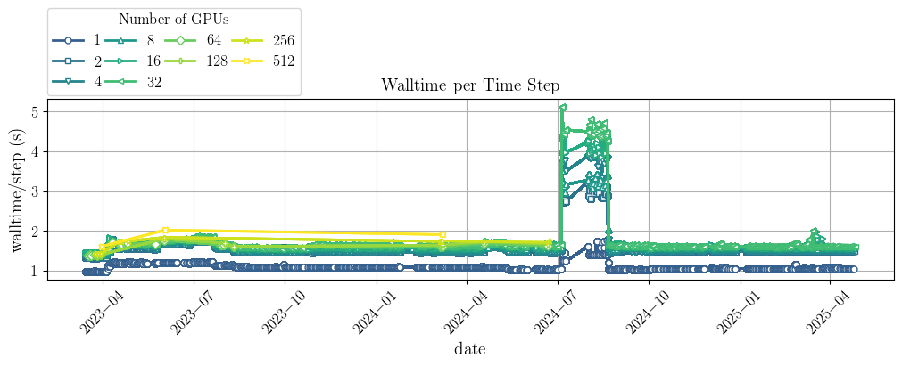
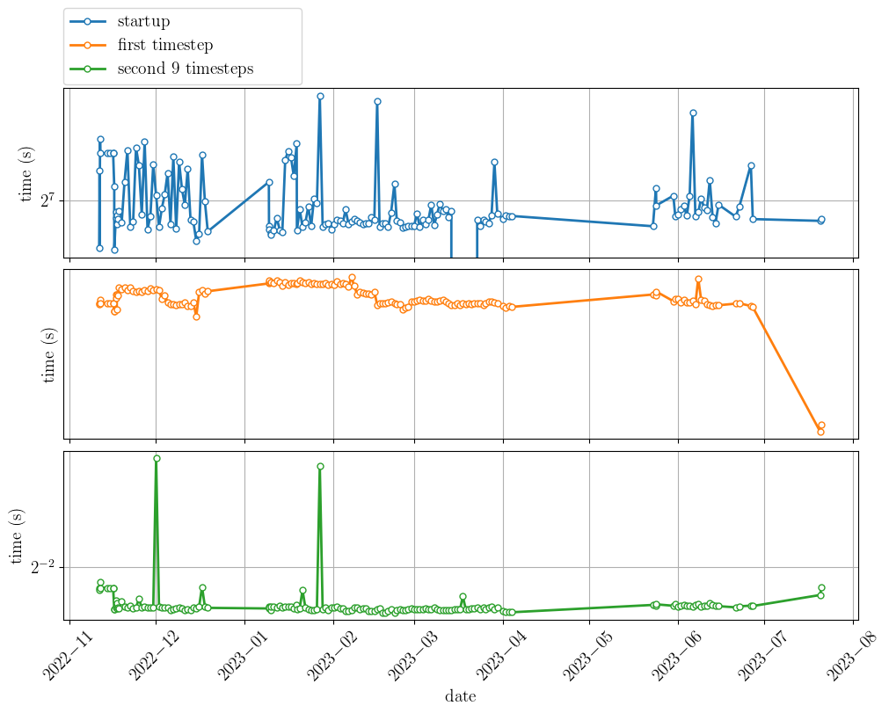
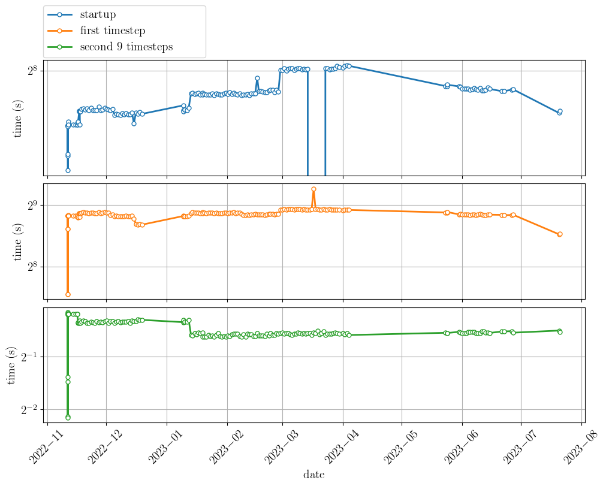
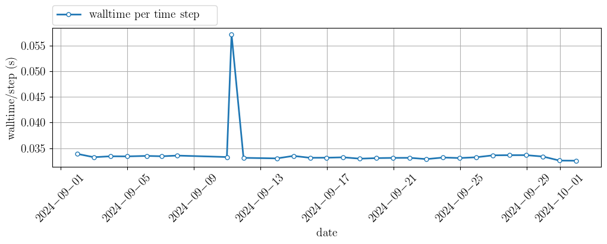
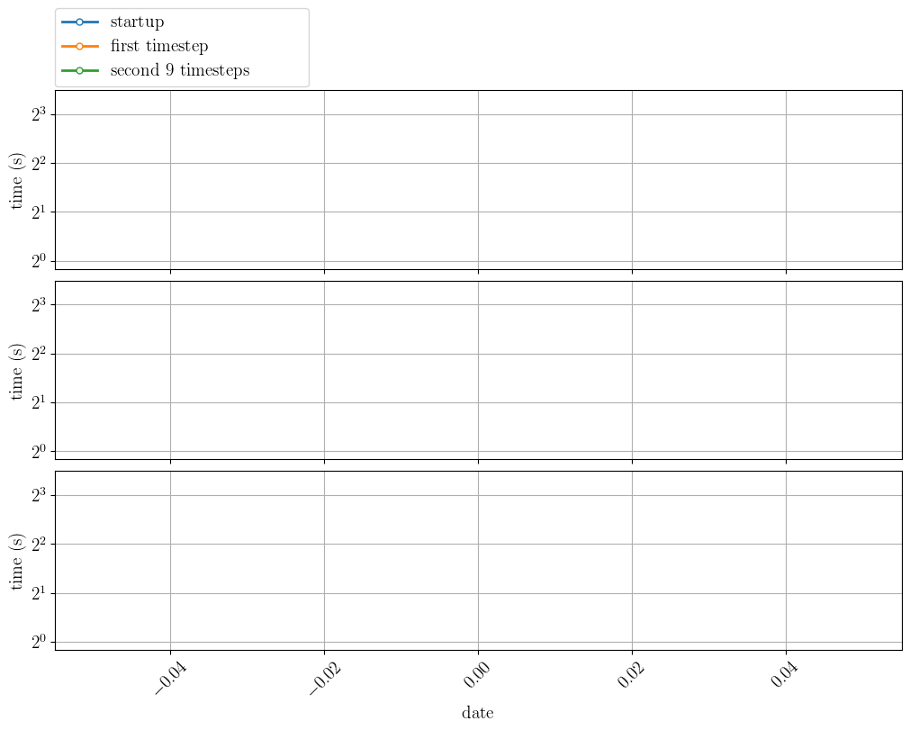

# Timing status (last ran on: 2023.07.21)

[](https://github.com/illinois-ceesd/timing/actions/workflows/y3-prediction-scalability.yaml) [](https://github.com/illinois-ceesd/timing/actions/workflows/y2-prediction-timing.yaml) [](https://github.com/illinois-ceesd/timing/actions/workflows/isolator-timing.yaml) [](https://github.com/illinois-ceesd/timing/actions/workflows/flame1d-timing.yaml) [](https://github.com/illinois-ceesd/timing/actions/workflows/nozzle-timing.yaml)

# Current timing plots

## Y3 Prediction: weak scaling on Lassen

### Startup, compile, and runtime


### Step details



### Scaling


## Y2 Prediction

### Smoke Test
#### Startup, compile, and step



#### Step details


### Smoke Test 3D
#### Startup, compile, and step


#### Step details


### Smoke Test KS
#### Startup, compile, and step



#### Step details


## Isolator - 2D inert

### Startup, compile, and step


### Step details



## Nozzle - 2D single gas

### Startup, compile, and step



### Step details


## Flame1D - 2D mixture with combustion

### Startup, compile, and step


### Step details


# Automated timings for CEESD production-ish runs

To run (should work anywhere):

```bash
$ curl -L -O https://raw.githubusercontent.com/illinois-ceesd/timing/main/time-y1-nozzle.sh
$ bash ./time-y1-nozzle.sh
```

To plot (requires matplotlib, yaml, pandas):
```bash
$ python utils/plot-timings.py
```
