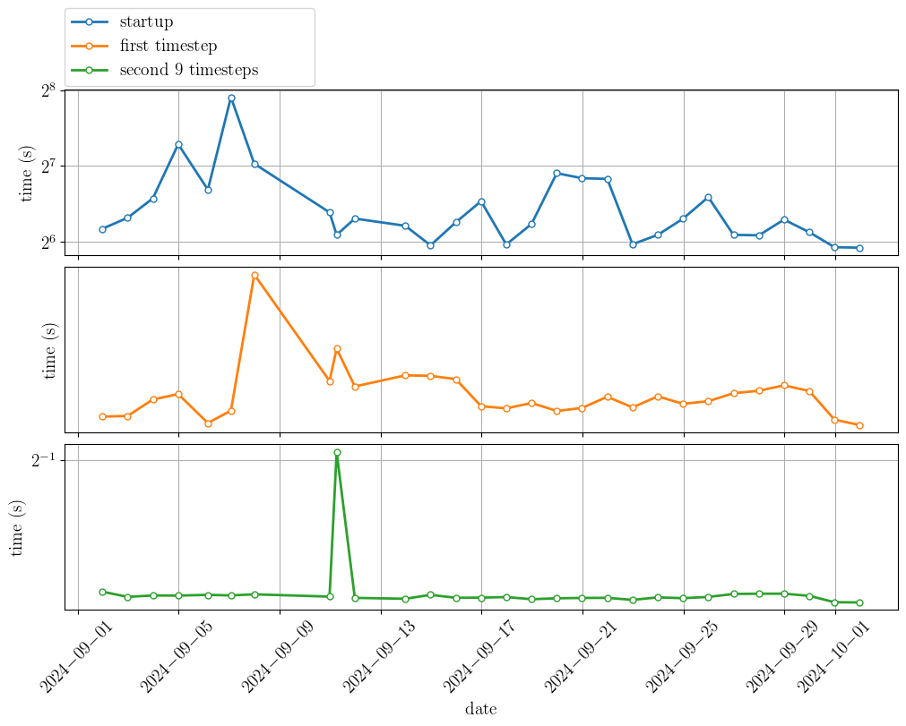

Timings last ran on: 2022.06.01

# Status of production timings

[](https://github.com/illinois-ceesd/timing/actions/workflows/isolator-timing.yaml)

[](https://github.com/illinois-ceesd/timing/actions/workflows/flame1d-timing.yaml)

[](https://github.com/illinois-ceesd/timing/actions/workflows/nozzle-timing.yaml)

# Current timing plots

## Isolator - 2D inert

### Startup, compile, and step



### Step details


## Nozzle - 2D single gas

### Startup, compile, and step


### Step details


## Flame1D - 2D mixture with combustion

### Startup, compile, and step


### Step details


# Automated timings for CEESD production-ish runs

To run (should work anywhere):

```bash
$ curl -L -O https://raw.githubusercontent.com/illinois-ceesd/timing/main/time-y1-nozzle.sh
$ bash ./time-y1-nozzle.sh
```

To plot (requires matplotlib, yaml, pandas):
```bash
$ python utils/plot-timings.py
```
