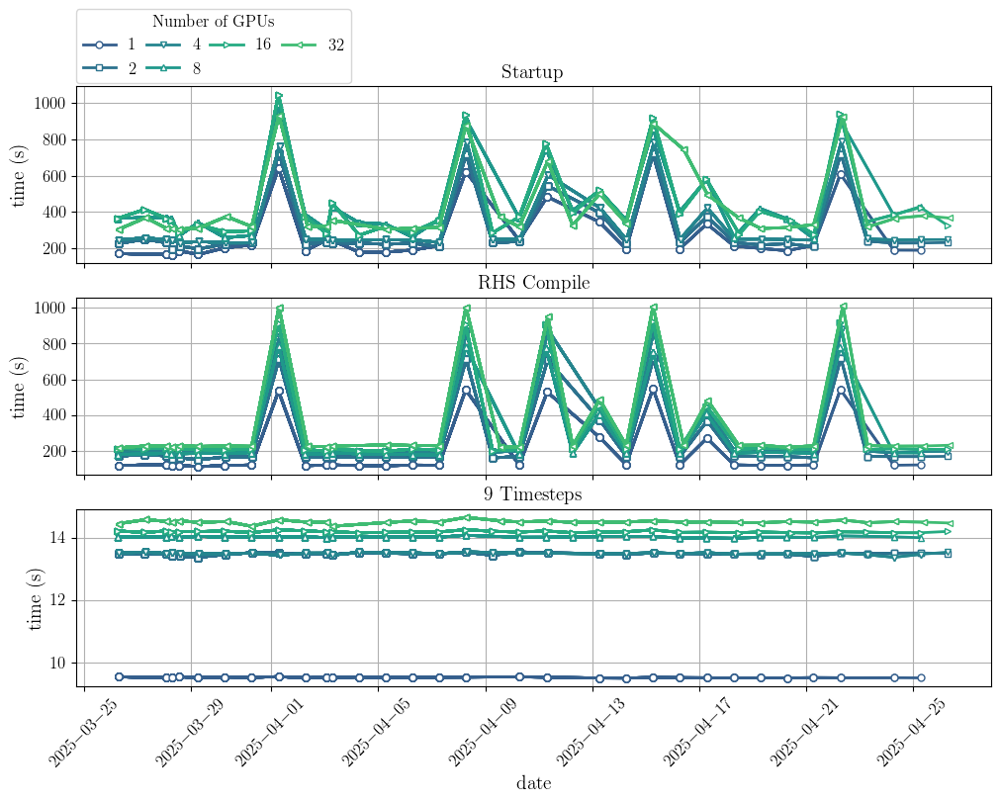
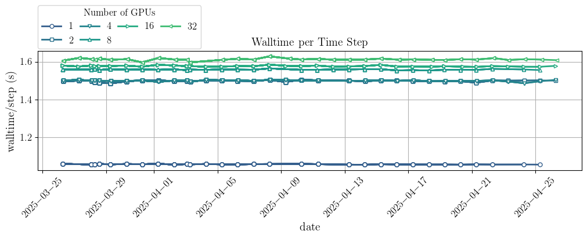
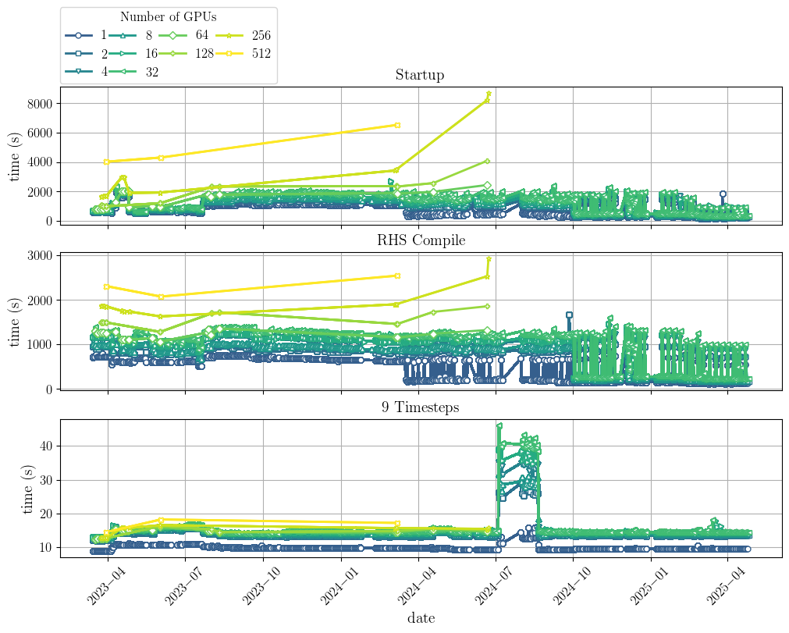

# Timing status (last ran on: 2024.12.04)

[](https://github.com/illinois-ceesd/timing/actions/workflows/y3-prediction-scalability.yaml)

# Current timing plots

## Y3 Prediction: weak scaling on Lassen

### Latest runs
#### Startup, compile, and runtime



#### Step details



### Lifetime monitoring

#### Scaling


#### Startup, compile, and runtime



#### Step details


# Plotting the data

To plot (requires matplotlib, yaml, pandas):
```bash
$ python utils/plot-multi-timings.py y3-prediction/<platform>/yaml/*.yaml
```
